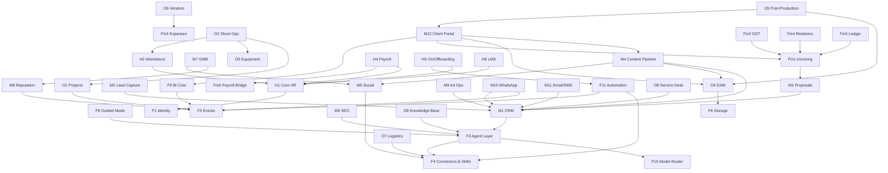

# 02 — Module Map

46 modules across five groups. Module IDs are stable and are used as filenames, cross-references and commit scopes throughout the repository.

## Classification

| Class | Meaning | SRS depth |
|---|---|---|
| **BUILD** | Written from scratch. The differentiators. | Full — data model, screens, API, agents, acceptance criteria |
| **WRAP** | Self-hosted OSS core + BPS adapter, UI and AI layer | Integration contract and extension surface only |
| **HOST** | Deploy and configure | Short — configuration, sync contract, SSO, backup |

---

## Progress

| Batch | Modules | State |
|---|---|---|
| 1 | F1, F2, F3, F4, F10, F11 | **Drafted** |
| 2 | F8, M1, M4, M10, M12 | **Drafted** |
| 3 | M2, M5, M6, M7, M8, M9 | Not started |
| 4 | O1, O2, O3, O4, O5 | Not started |
| 5 | Fin1–Fin6, M3, M11 | Not started |
| 6 | H1–H8, O6–O9, F5, F6, F7, F9 | Not started |

---

## Foundation — F1–F11

Everything else depends on these. All BUILD.

| ID | Module | Batch | Status |
|---|---|---|---|
| F1 | [Identity, Auth, RBAC & Org Model](srs/F1-identity-auth-rbac.md) | 1 | Draft |
| F2 | [Data Model & Tenancy Conventions](srs/F2-data-model-tenancy.md) | 1 | Draft |
| F3 | [AI Agent Layer & Orchestration](srs/F3-ai-agent-layer.md) | 1 | Draft |
| F4 | [Connector & Skills Registry (MCP)](srs/F4-connector-skills-registry.md) | 1 | Draft |
| F5 | Notification & Event Bus | 6 | — |
| F6 | File & Object Storage Core | 6 | — |
| F7 | Audit, Observability & Backup | 6 | — |
| F8 | [Guided Mode & Onboarding](srs/F8-guided-mode-onboarding.md) | 2 | Draft |
| F9 | Reporting & BI Core | 6 | — |
| F10 | [AI Model Router & Cost Governor](srs/F10-model-router-cost-governor.md) | 1 | Draft |
| F11 | [Automation & Workflow Engine](srs/F11-automation-workflow-engine.md) | 1 | Draft |

---

## Marketing — M1–M12

| ID | Module | Class | Batch |
|---|---|---|---|
| M1 | [AI CRM](srs/M1-ai-crm.md) — *replaces Maglo CRM* | BUILD | 2 · **Draft** |
| M2 | Lead Capture — forms, landing pages, lead-ad ingestion | BUILD | 3 |
| M3 | Proposals, Quotations, Contracts & E-Signature | BUILD | 5 |
| M4 | [**Content Delivery Pipeline**](srs/M4-content-delivery-pipeline.md) | BUILD | 2 · **Draft** |
| M5 | Social Media Management *(Buffer-class)* | BUILD + WRAP Postiz | 3 |
| M6 | Agentic SEO | BUILD + paid data API | 3 |
| M7 | Google Business Profile *(Dhanda-class)* | BUILD | 3 |
| M8 | Reputation & Review Management | BUILD | 3 |
| M9 | Ad Ops — Meta campaigns, pacing, reporting | BUILD | 3 |
| M10 | [**WhatsApp Business Platform**](srs/M10-whatsapp-business-platform.md) — *replaces Babbler* | BUILD | 2 · **Draft** |
| M11 | Email & SMS Marketing | WRAP Listmonk | 5 |
| M12 | [Client Portal & White-Label Reporting](srs/M12-client-portal.md) | BUILD | 2 · **Draft** |

M4 encodes what BPS actually sells. M7 and M10 are the most directly resellable to existing clients.

---

## Human Resources — H1–H8

Mostly WRAP over **Frappe HR**, which already implements Indian payroll statutory requirements.

| ID | Module | Class | Batch |
|---|---|---|---|
| H1 | Core HR — employee master, documents, org chart | WRAP | 6 |
| H2 | Attendance & Time — incl. geo check-in for field crews | WRAP + BUILD ext | 6 |
| H3 | Leave Management | WRAP | 6 |
| H4 | Payroll — PF, ESI, PT, TDS | WRAP | 6 |
| H5 | Recruitment / ATS | WRAP | 6 |
| H6 | Onboarding & Offboarding Workflows | BUILD | 6 |
| H7 | Performance — OKR/KPI, review cycles | WRAP + BUILD ext | 6 |
| H8 | Learning & Development / LMS | BUILD | 6 |

H2's field extension exists because event shoot crews do not fit a desk-based attendance model.

---

## Operations — O1–O9

| ID | Module | Class | Batch |
|---|---|---|---|
| O1 | Project & Task Management *(Notion replacement)* | BUILD | 4 |
| O2 | Production & Shoot Operations | BUILD | 4 |
| O3 | Equipment, Inventory & Studio Rental Booking | BUILD | 4 |
| O4 | **DAM & Media Review/Approval** *(Frame.io replacement)* | BUILD | 4 |
| O5 | Post-Production Workflow & Client Delivery | BUILD | 4 |
| O6 | Vendor & Freelancer Management | BUILD | 6 |
| O7 | Delivery & Logistics | BUILD | 6 |
| O8 | Service Desk & Ticketing | WRAP Chatwoot | 6 |
| O9 | Knowledge Base, SOPs & AI Assistant | BUILD | 6 |

---

## Finance — Fin1–Fin6

Mostly WRAP over **ERPNext**. Indian GST and e-invoicing rules change by statute; they are never hand-rolled.

| ID | Module | Class | Batch |
|---|---|---|---|
| Fin1 | Quotation → Invoice → Payment | WRAP + BUILD UI | 5 |
| Fin2 | GST & E-Invoicing Compliance | WRAP | 5 |
| Fin3 | Expenses, Purchases & Vendor Bills | WRAP | 5 |
| Fin4 | Retainer & Subscription Billing + Dunning | BUILD | 5 |
| Fin5 | Accounting Ledger, P&L, Cash Flow | WRAP | 5 |
| Fin6 | Payroll Disbursement Bridge | WRAP | 5 |

Fin1 and Fin4 together address the largest manual burden visible in the BPS inbox.

---

## Dependency graph

Foundation edges (every module depends on F1, F2, F7) are omitted for readability. **The graph must remain acyclic.**



### Critical path

```
F1 → F2 → F3 → F10 → F4 → F11 → M1 → M4 → M12
```

Nothing client-facing ships before this chain is complete.

---

## Authoring batches

Each batch is delivered for review before the next begins.

| Batch | Modules | Rationale |
|---|---|---|
| **1** | F1, F2, F3, F4, F10, F11 | The AI and automation spine. **Hard gate** — errors here propagate to all 40 remaining documents. |
| 2 | F8, M1, M4, M10, M12 | Guided mode plus the commercial core |
| 3 | M2, M5, M6, M7, M8, M9 | Full marketing surface |
| 4 | O1, O2, O3, O4, O5 | How work gets delivered |
| 5 | Fin1–Fin6, M3, M11 | Money in, money out, contracts |
| 6 | H1–H8, O6–O9, F5, F6, F7, F9 | HR (mostly WRAP, therefore short) and remaining support |

---

## Coverage check

Used to verify the SRS set is complete. Every subscription in `00-vision.md` must appear here with an owning module.

| Replaced tool | Owning module(s) |
|---|---|
| Notion | O1, M1, O9 |
| Odoo | Fin1–Fin6 |
| **Makunai Babbler** (WhatsApp) | M10 |
| **Makunai Maglo CRM** | M1 |
| Buffer / Hootsuite | M5 |
| Frame.io / WeTransfer | O4, F6 |
| Keka | H1–H7 |
| WPForms | M2 |
| Akismet | *(retired with WordPress)* |
| eBundleTools | F10, M6 |
| Emergent | *(retired — platform supersedes)* |
| Dhanda-class GMB tooling | M7, M8 |
| Make / Zapier class | F11 |
